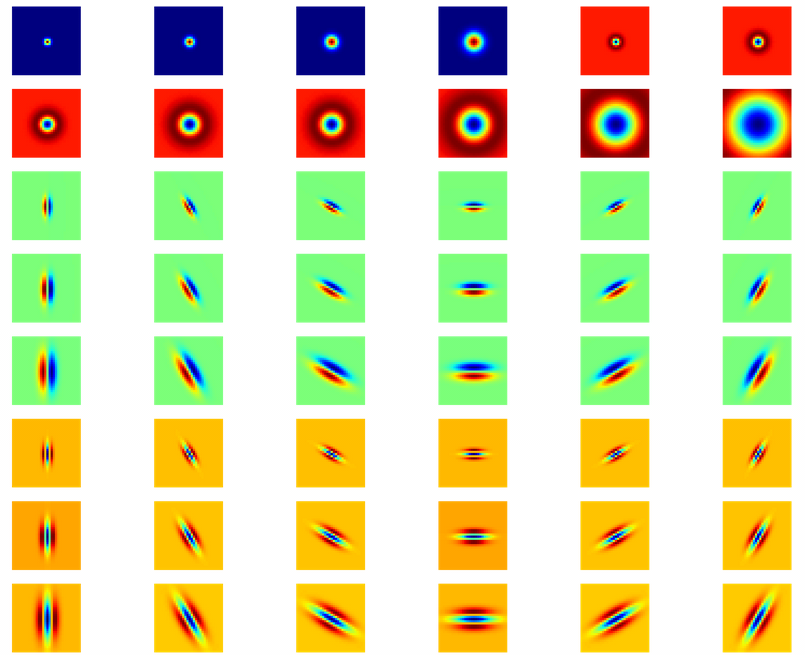
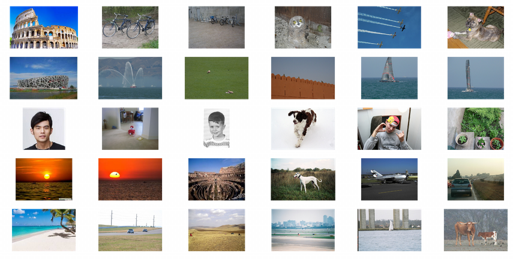
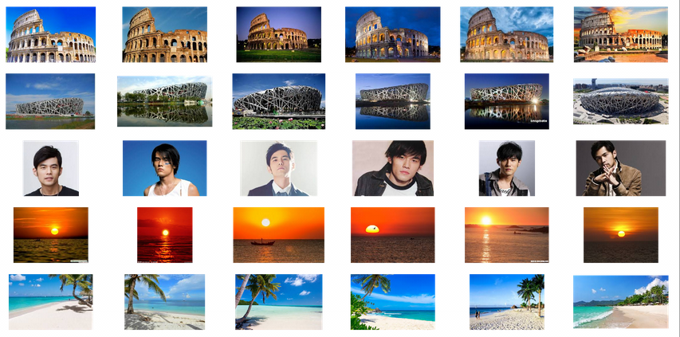

# FilterBank_Python
python code for generating Filter Bank using for image retrieval. Contents including:
1. Derive 2D Gaussion filter and Laplacian of Gaussion (LoG) (in report.pdf)
2. Generate a filter bank of 48 image filters, each with 32 & times 32, including 4 Gaussion filters, 8 LoG filters, 18 x-directional first derivation of Gaussian filters and 18 x-directional second derivation of Gaussian filters
3. Retrieve top5 images given a image query using filter bank and deep features 

## Filter Bank (48)

## Top5 Retrieval Results
Filter Bank features

Deep Features from ResNet101

## Acknowledgement
[http://www.robots.ox.ac.uk/~vgg/research/texclass/filters.html](http://www.robots.ox.ac.uk/~vgg/research/texclass/filters.html)
